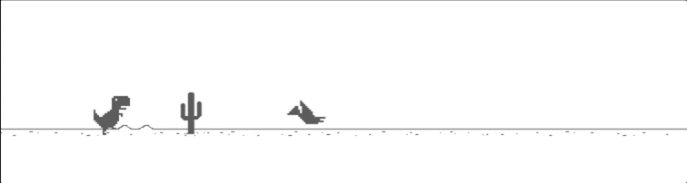

# T-rex timetravel

Demo frontend application created for [Tooploox](https://www.tooploox.com/) Open Office - Halloween Style Day.

## Inspiration

T-Rex timetravel was inspired by Chrome T-rex Game, but additional feature of `time manipulation` (using Redux and Immutable state) was added.
Moreover simple `physics engine` was also designed with support of Newton's laws of motion.

## How to play

`↑` to jump

`↓` to duck (bend down)

`space` to pause time

`r` to reverse time

## Development

### On the host machine

Install the `npm` packages described in the `package.json`:

    npm install

Run `webpack` server:

    npm start

Application should start on http://localhost:4000/.

## Testing

### On the host machine

    npm test

## Built With

* TypeScript
* [Redux](https://github.com/reactjs/redux) - Predictable state container for JavaScript apps
